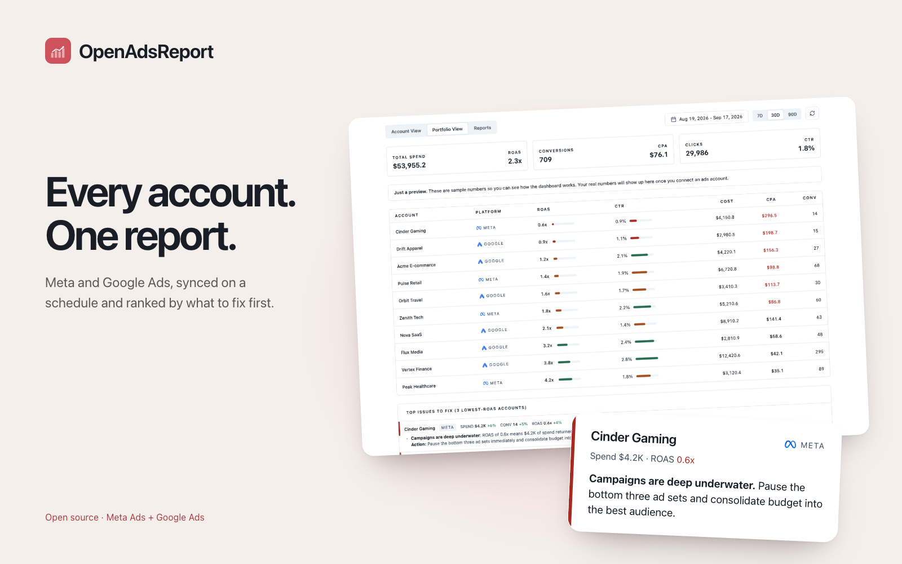

# OpenAdsReport

[](https://app.clawnify.com/deploy?repo=clawnify/open-ads-report)

A live, cross-platform ads dashboard for **Meta Ads** and **Google Ads**. The app
owns every calculation and exposes the results as a clean JSON API — the same
surface that powers the UI is what Clawnify makes available to agents (via MCP/API)
and to Claude Code.

## Views

- **Portfolio View** — all accounts across all connected platforms in one table
  (ROAS / CTR / cost / CPA / conversions), sorted worst-to-best by ROAS, with
  aggregate KPI cards and the top issues across the three lowest-ROAS accounts.
- **Account View** — one account in depth: KPI cards with period-over-period
  deltas, three combo charts (Cost/ROAS, Conversions/Conv-rate, Clicks/CTR), a
  channel breakdown, and that account's top issues.
- **Reports** — analyst reports built from live data. Pick a recipe, generate,
  export to PDF. Prose is AI-written when `OPENROUTER_API_KEY` is set,
  deterministic heuristics otherwise — every number is always computed by the
  app, never by the model.
  - **Account Audit** (Meta + Google) — a scored health check: /100 overall,
    per-category ratings (conversion tracking, wasted spend, impression
    coverage, ad creative quality, Quality Score, bidding strategy on Google;
    tracking, spend efficiency, creative fatigue, delivery on Meta), the worst
    category flagged as the place to start, and priority fixes ranked by the
    dollars at stake.
  - **Search Terms** (Google) — the top search terms by cost vs conversions,
    wasted spend quantified, and zero-conversion terms suggested as exact
    negatives.
  - **Creative Fatigue** (Meta) — every analyzed ad's frequency, CTR/CPM/CPA
    drift for the current vs prior window; flags ads with frequency above 2.5
    and CTR falling more than 15%, ranked by spend, plus the winners safe to
    scale.
  - **Landing Page Analysis** (Google Analytics) — paid-traffic landing pages,
    current vs prior period: conversion-rate drops, bounce-rate spikes
    (> 10pp flagged), revenue per session, and a fix order ranked by
    recoverable revenue with one specific suggestion per page. Needs the
    Google Analytics integration connected; GA4 exposes no page-speed
    metrics, so load time is out of scope.

When no ad platform is connected the dashboard renders **sample/preview data** so
it looks alive inside the Clawnify iframe.

## JSON API

All endpoints accept `since` / `until` (`YYYY-MM-DD`) or `days` (defaults to 30).
Period-over-period deltas use the equal-length window immediately before `since`.

| Endpoint | Returns |
|----------|---------|
| `GET /api/state` | Connected platforms + whether preview mode is active |
| `GET /api/accounts` | Account list across connected platforms (for the picker) |
| `GET /api/portfolio?since=&until=` | `PortfolioReport`: totals, per-account rows, top issues |
| `GET /api/account?platform=&account_id=&since=&until=` | `AccountReport`: KPIs+deltas, daily series, channel, issues |
| `GET /api/reports` | The report recipe gallery (id, name, platforms, availability) |
| `GET /api/report?recipe=&platform=&account_id=&since=&until=` | `ReportDoc`: a full analyst report as typed sections/blocks |

Shapes live in [`src/server/providers/types.ts`](src/server/providers/types.ts).
All metric math (ROAS, CPA, CTR, conversion rate, deltas, issue derivation) is in
[`src/server/metrics.ts`](src/server/metrics.ts) so Meta and Google numbers are
computed identically.

## Credentials

All credentials are accessed through [`@clawnify/connections`](https://www.npmjs.com/package/@clawnify/connections):

```ts
import { connect, secret } from "@clawnify/connections";

connect("metaads", env).get("/me/adaccounts", { fields: "name,id" });
connect("googleads", env).query("SELECT customer.id FROM customer");
secret("OPENROUTER_API_KEY", env);
```

App code is identical whether a connection is OAuth or managed — the SDK routes
to the right backend. What the app needs is declared once in
[`src/server/requires.ts`](src/server/requires.ts) and reported (with the
dashboard step for anything missing) at `GET /api/state`.

In production Clawnify injects the credentials binding and the org id; connect
`metaads` / `googleads` and add `OPENROUTER_API_KEY` **in the Clawnify dashboard**.
For local `pnpm dev`, copy `.dev.vars.example` → `.dev.vars`:

- **Meta:** `METAADS_BEARER_TOKEN` (scope: `ads_read`)
- **Google:** `GOOGLEADS_ACCESS_TOKEN` + `GOOGLEADS_DEVELOPER_TOKEN` +
  `GOOGLEADS_LOGIN_CUSTOMER_ID` (managed Google Ads needs none of these in
  production — they're a local-dev fallback only)
- Optional: `GOOGLEADS_API_VERSION` (default `v21`) — bump if Google has retired
  that API version.
- Optional: `OPENROUTER_API_KEY` for AI-generated issue hints.

## Develop & deploy

```bash
pnpm install
pnpm dev        # vite (UI) + wrangler (API) together
pnpm build      # vite build → dist/
npx clawnify deploy
```

## How reports work

The report engine ([`src/server/report.ts`](src/server/report.ts)) assembles a
typed document — sections of blocks (scorecard, KPIs, charts, tables, findings,
recommendations) — from numbers the app computed. The scoring math lives in
[`src/server/audit.ts`](src/server/audit.ts); the AI layer only writes the
summary and findings prose around those numbers, so dollar amounts and scores
are always deterministic and reproducible. The same `GET /api/report` JSON that
the Reports view renders is what agents consume.
